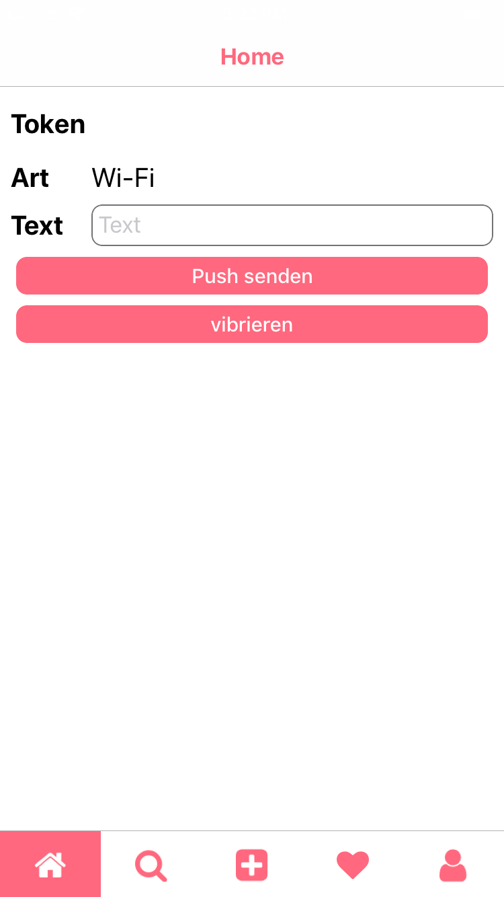
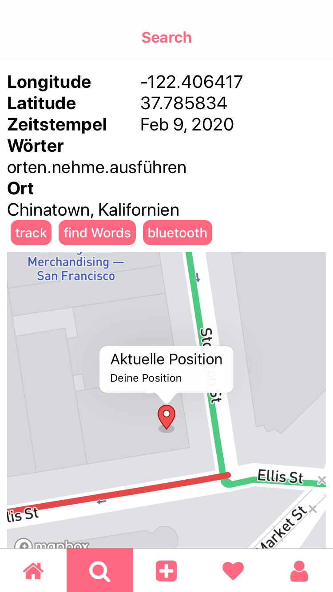
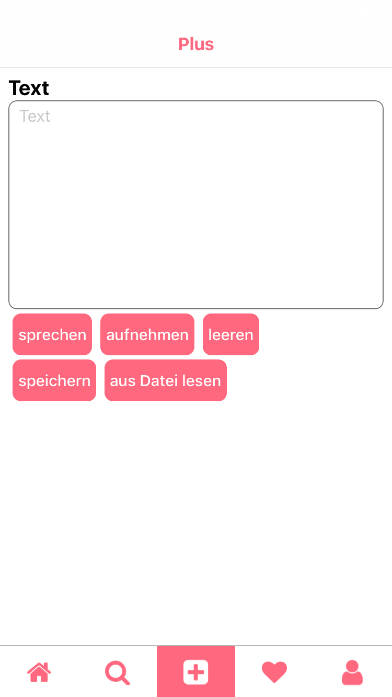
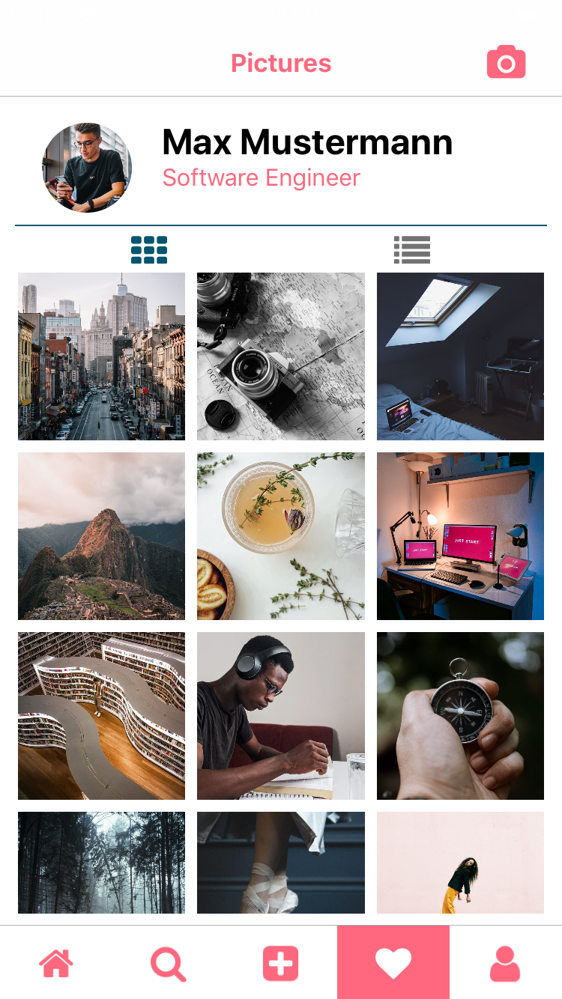
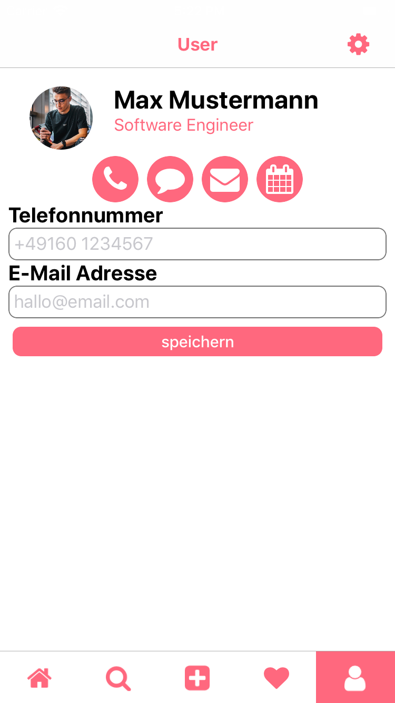
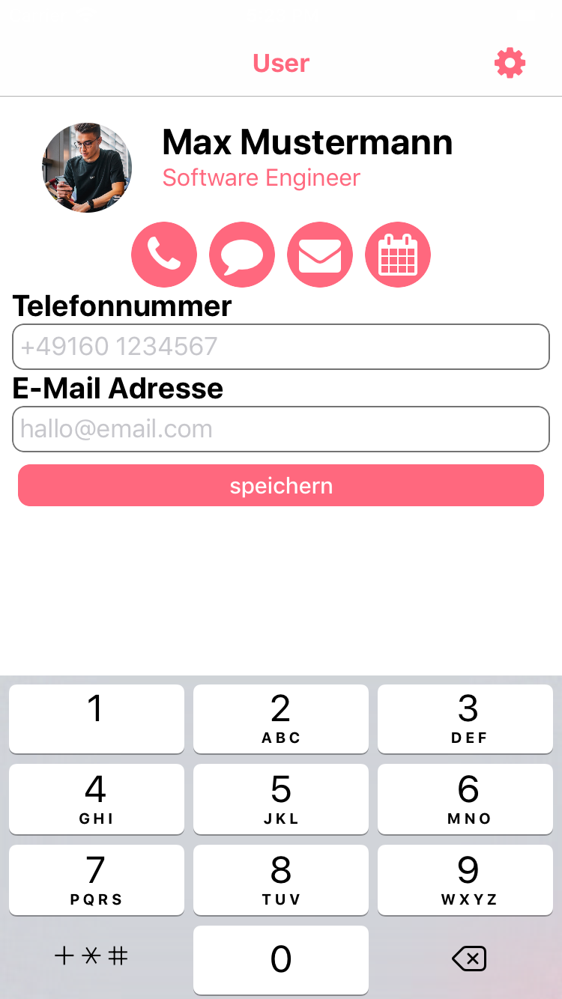
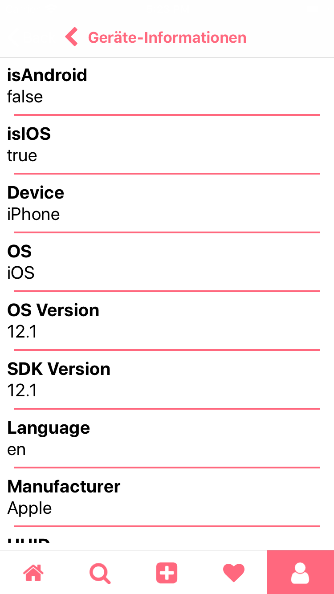
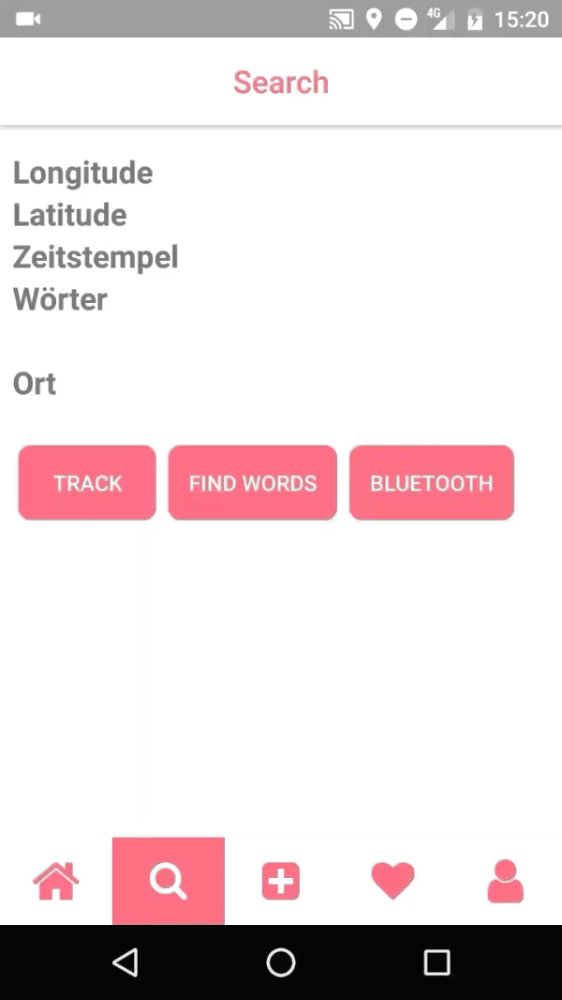

# chatbot-typescript

## NativeScript Preview
Ausführen von `tns preview`
Dadurch wird ein QR-Code erzeugt, der mittels der App [Playground](https://play.google.com/store/apps/details?id=org.nativescript.play) gescannt werden. Anschließend wird die App aus der Entwicklungsumgebung in der App [Preview](https://play.google.com/store/apps/details?id=org.nativescript.preview) dargestellt.

## build der APK-Datei
Ausführen von `tns build android --release --key-store-path .keystore --key-store-password Telekom123! --key-store-alias "David Savic" --key-store-alias-password Telekom123!`
Hierdurch wird die APK-Datei für Android erzeugt, die für die Installation bereitgestellt werden kann.

## Ausführen auf verbundenem Android-Smartphone
Zunächst müsst ihr in den Entwickleroptionen des Smartphones das USB-Debugging aktivieren und anschließend das Smartphone per USB an den PC anschließen.
Um den Device Identifier zu ermitteln müsst ihr den folgenden Befehl ausführen. Der Device Identifier wird benötigt, um die App auf dem Smartphone auszuführen: `tns device`
Als Ergebnis bekommt ihr eine Tabelle mit allen verbundenen Geräten:

 No | Device Name │ Platform │ Device Identifier │ Type │ Status
 -- | ----------- | -------- | ----------------- | ---- | ------
 1 │ FP2 │ Android │ fa8f674 │ Device │ Connected

Der Device Identifier muss nun verwendet werden, um die App mit dem Befehl `tns run` zu starten. Dort wird noch ein Parameter für den Device Identifier mitgegeben.
Der Befehl sieht schlussendlich wie folgt aus: `tns run --device fa8f674`
Die App öffnet sich nach kurzer Zeit auf dem verbundenen Smartphone. Hilfreich ist es noch die Option "Aktiv lassen" in den Entwickleroptionen zu aktivieren, damit das Smartphone die ganze Dauer über aktiv bleibt.
Die Änderungen werden beim Speichern direkt per LiveSync auf das Smartphone übernommen.

### Used Plugins
* nativescript-bluetooth - Version: 1.3.1
* nativescript-calendar - Version: 2.1.0
* nativescript-camera - Version: 4.5.0
* nativescript-email - Version: 1.5.5
* nativescript-geolocation - Version: 5.1.0
* nativescript-local-notifications - Version: 4.1.5
* nativescript-mapbox - Version: 4.4.1
* nativescript-phone - Version: 1.4.1
* nativescript-pushy - Version: 2.1.0
* nativescript-speech-recognition - Version: 1.5.0
* nativescript-sqlite - Version: 2.3.3
* nativescript-texttospeech - Version: 2.0.2
* nativescript-theme-core - 1.0.6
* nativescript-toasty - Version: 2.0.1
* nativescript-vibrate - Version: 3.0.0

```typescript
// replace those values in api-token.service
private _what3words = "WHAT3WORDS_API_KEY";
private _pushy = "PUSHY_API_KEY";
private _mapbox = "MAPBOX_API_KEY";
```

## Ausführen der Anwendung
```shell script
# install NativeScript dependencies
tns install
# start app for android
tns run android
# start app for ios
tns run ios
# start tns preview for scanning a qr code and test this app with nativescript preview and playground
tns preview
```

## Examples
### Screenshots
</img>
</img>
</img>
</img>
</img>
</img>
</img>

### Gifs

